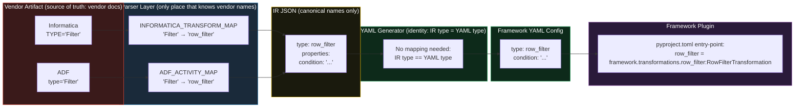

# Canonical Connector & Transformation Taxonomy

**Document Type:** Engineering Reference — Naming Standard  
**Version:** 1.0  
**Status:** Approved — governs all IR, YAML, and plugin naming

---

## Why a Canonical Taxonomy?

The framework, the IR, and the YAML config must all use the **same vendor-neutral names**. These names must:

1. Describe *what the operation does*, not *what a vendor calls it*
2. Be stable regardless of whether the source is Informatica, ADF, SSIS, or hand-authored YAML
3. Map cleanly to one place in the codebase where vendor → canonical translation happens

**The single translation point is the parser.** Downstream of the parser, the entire system speaks canonical names only.

```
Informatica "Filter Transformation"  ─┐
ADF "Filter Activity"                 ─┼──► Parser ──► IR: row_filter ──► YAML: row_filter ──► Plugin: row_filter
SSIS "Conditional Split" (partial)    ─┘
```

---

## Naming Convention

| Rule | Example |
|---|---|
| All lowercase with underscores | `row_filter`, `lookup_enrich` |
| Prefix indicates operation class | `row_`, `column_`, `stream_`, `scd_` |
| Name describes the operation, not the source | `column_derive` not `expression` |
| SCD terms are industry-standard, keep them | `scd_type_2` |
| Connector names match the DBMS / protocol name | `sqlserver`, `postgres`, `kafka` |

---

## Transformation Catalog

### Phase 1 — MVP (implement first; required for 60% of estate)

| Canonical Name | Old Name (POC) | What It Does | Informatica Source | ADF Source |
|---|---|---|---|---|
| `row_filter` | `filter` | Remove rows that don't match a boolean condition | Filter Transformation | Filter Activity |
| `column_derive` | `expression` | Compute new columns from expressions; rename/cast existing columns | Expression Transformation | Derived Column Activity |
| `lookup_enrich` | `lookup` | Enrich rows by joining to a reference dataset on a key | Lookup Transformation / Lookup Procedure | Lookup Activity |
| `stream_join` | *(new)* | Join two or more input streams on keys (inner, left, full) | Joiner Transformation | Join Activity |
| `aggregate` | *(new)* | Group rows and compute aggregate functions (sum, count, avg, max, min) | Aggregator Transformation | Aggregate Activity |
| `scd_type_2` | `scd_type_2` | Slowly-changing dimension Type 2: expire old version, insert new | Update Strategy (SCD2 mode) | n/a (custom) |

### Phase 2 — Production (implement in migration wave 1)

| Canonical Name | Old Name | What It Does | Informatica Source | ADF Source |
|---|---|---|---|---|
| `column_select` | *(new)* | Project, drop, or rename columns without computing new ones | Expression (port selection) | Select Activity |
| `union_all` | *(new)* | Concatenate multiple input streams (all rows, no dedup) | Union Transformation | Union Activity |
| `row_sort` | *(new)* | Order rows by one or more columns | Sorter Transformation | Sort Activity |
| `route_split` | *(new)* | Split a stream into named output branches by condition | Router Transformation | Conditional Split Activity |
| `scd_type_1` | *(new)* | Slowly-changing dimension Type 1: overwrite existing row | Update Strategy (overwrite) | n/a (custom) |
| `row_deduplicate` | *(new)* | Remove duplicate rows based on key columns | *(custom logic)* | n/a |

### Phase 3 — Advanced (implement in migration wave 2+)

| Canonical Name | What It Does | Informatica Source | ADF Source |
|---|---|---|---|
| `sequence_generate` | Generate sequential integer surrogate keys | Sequence Generator | *(custom)* |
| `rank` | Rank rows within a partition by an order key | Rank Transformation | Window Activity (RANK) |
| `window_fn` | General window functions (ROW_NUMBER, LAG, LEAD, etc.) | *(custom)* | Window Activity |
| `pivot` | Transpose rows to columns (wide format) | *(custom)* | Pivot Activity |
| `unpivot` | Transpose columns to rows (long format) | Normalizer Transformation | Unpivot Activity |
| `flatten_json` | Flatten nested JSON arrays into rows | *(custom)* | Flatten Activity |
| `mask_pii` | Redact or hash PII columns | *(Data Quality)* | *(custom)* |
| `data_validate` | Assert data quality rules; route failures to dead-letter | *(Data Quality)* | *(custom)* |
| `python_fn` | Escape hatch: apply arbitrary Python function to DataFrame | *(Java/Advanced)* | Script Activity |

### Transformation: Properties Contract

Each transformation type has a properties schema. These are the canonical property names used in both IR and YAML — not Informatica's `TABLEATTRIBUTE NAME` values.

#### `row_filter`
```yaml
type: row_filter
condition: "status == 'ACTIVE'"   # Pandas query expression (canonical Python)
```

#### `column_derive`
```yaml
type: column_derive
derivations:
  full_name: "first_name + ' ' + last_name"
  age_bucket: "pd.cut(df['age'], bins=[0,18,35,55,100])"
```

#### `lookup_enrich`
```yaml
type: lookup_enrich
lookup_source:
  connector: postgres
  connection: ref_data_prod
  table: dim_segment
join_keys:
  - left: segment_code
    right: code
return_columns: [segment_name, segment_tier]
on_no_match: null           # null | reject | default
```

#### `stream_join`
```yaml
type: stream_join
inputs: [left_stream, right_stream]
join_type: left             # inner | left | right | full
join_keys:
  - left: customer_id
    right: cust_id
```

#### `aggregate`
```yaml
type: aggregate
group_by: [region, product_code]
measures:
  total_sales: "sum(amount)"
  order_count: "count(order_id)"
  avg_value:   "mean(amount)"
```

#### `scd_type_2`
```yaml
type: scd_type_2
natural_key: [customer_id]
tracked_columns: [full_name, email, segment_code]
effective_from_col: effective_from
effective_to_col:   effective_to
current_flag_col:   current_flg
surrogate_key_col:  customer_key
```

#### `column_select`
```yaml
type: column_select
columns:
  customer_id: customer_id      # keep as-is
  cust_name: full_name          # rename full_name → cust_name
  status: status
# columns not listed are dropped
```

#### `route_split`
```yaml
type: route_split
routes:
  active_customers: "status == 'ACTIVE'"
  inactive_customers: "status == 'INACTIVE'"
  other: "__default__"    # catch-all route
```

---

## Connector Catalog

### Phase 1 — MVP (required for 60% of estate)

| Canonical Name | What It Connects To | Informatica Source | ADF Linked Service |
|---|---|---|---|
| `sqlite` | SQLite file database (dev/test only) | *(not applicable)* | *(not applicable)* |
| `csv` | Delimited text files (local, S3, GCS, ADLS) | Flat File (CSV) | Delimited Text Dataset |
| `parquet` | Parquet files (local, S3, GCS, ADLS) | *(not applicable)* | Parquet Dataset |
| `postgres` | PostgreSQL database | ODBC (PostgreSQL) | Azure Database for PostgreSQL |
| `sqlserver` | Microsoft SQL Server / SQL Server on RDS | MS SQL Server | SQL Server Linked Service |
| `oracle` | Oracle Database | Oracle | Oracle Linked Service |
| `s3` | AWS S3 bucket (any file format via `format` param) | PowerExchange for S3 | Amazon S3 Linked Service |

### Phase 2 — Production (required for 80% of estate)

| Canonical Name | What It Connects To | Informatica Source | ADF Linked Service |
|---|---|---|---|
| `snowflake` | Snowflake cloud data warehouse | Snowflake | Snowflake Linked Service |
| `mysql` | MySQL / MariaDB | ODBC (MySQL) | Azure Database for MySQL |
| `azure_sql` | Azure SQL Managed Instance | MS SQL Server | Azure SQL MI Linked Service |
| `adls` | Azure Data Lake Storage Gen2 | PowerExchange for Azure | ADLS Gen2 Linked Service |
| `kafka` | Apache Kafka / Azure Event Hub | PowerExchange Kafka | Event Hub Linked Service |
| `gcs` | Google Cloud Storage | *(not applicable)* | *(not applicable)* |

### Phase 3 — Advanced (required for 95% of estate)

| Canonical Name | What It Connects To | Informatica Source | ADF Linked Service |
|---|---|---|---|
| `http_api` | REST HTTP endpoint | *(custom)* | HTTP Linked Service |
| `sftp` | SFTP server (generic) | SFTP | SFTP Linked Service |
| `mainframe_sftp` | Mainframe files via SFTP with EBCDIC/COBOL parsing | PowerExchange Mainframe | *(not applicable)* |

### Connector: Properties Contract

All connectors share common properties. The `connection` field is always a secrets reference — never raw credentials.

```yaml
# Source connector (in sources[])
- id: src_customers
  connector: sqlserver           # canonical connector name
  connection: prod_sqlserver_crm # secrets reference → resolved at runtime
  query: |                       # use query OR table, not both
    SELECT customer_id, first_name, last_name, status, segment_code
    FROM   dbo.customers
    WHERE  updated_dt > :last_run_dt
  # OR
  table: customers               # simple full-table read

# File connector extras
- id: src_invoices
  connector: csv
  connection: s3_data_bucket     # resolves to S3 bucket path
  file_path: "raw/invoices/{{ date }}/invoices.csv"
  format: csv                    # csv | parquet | json | fixed_width
  options:
    delimiter: ","
    encoding: utf-8
    skip_rows: 1
```

```yaml
# Target connector (in targets[])
- id: tgt_dim_customer
  connector: postgres
  connection: prod_postgres_dw
  table: public.dim_customer
  input: scd_step                # upstream transform/source id
  load_strategy: scd_type_2_merge   # append | overwrite | upsert | scd_type_2_merge | merge_on_key
  upsert_keys: [customer_id]
```

---

## Vendor Mapping Tables

These tables live exclusively in the parser layer. **Downstream code must never reference these tables.**

### Informatica PowerCenter → Canonical

```python
# agent/agents/parser/informatica.py

INFORMATICA_TRANSFORM_MAP: dict[str, str | None] = {
    # Transformation TYPE attribute value → canonical IR type
    "Filter":              "row_filter",
    "Expression":          "column_derive",
    "Lookup Procedure":    "lookup_enrich",
    "Lookup":              "lookup_enrich",
    "Joiner":             "stream_join",
    "Aggregator":          "aggregate",
    "Sorter":             "row_sort",
    "Union":              "union_all",
    "Router":             "route_split",
    "Sequence Generator": "sequence_generate",
    "Rank":               "rank",
    "Normalizer":         "unpivot",
    "Update Strategy":    "scd_type_1",     # may become scd_type_2 based on UPDATEOVERRIDE config
    "Stored Procedure":   None,              # no automatic conversion — manual queue
    "Java Transformation": None,             # no automatic conversion — manual queue
    "HTTP Transformation": None,             # no automatic conversion — manual queue
    "Web Services":        None,             # no automatic conversion — manual queue
}

INFORMATICA_CONNECTOR_MAP: dict[str, str | None] = {
    # DBDNAME / SOURCE DBTYPE attribute value → canonical connector name
    "SQLSERVER":        "sqlserver",
    "MSSQL":            "sqlserver",
    "ORACLE":           "oracle",
    "POSTGRESQL":       "postgres",
    "MYSQL":            "mysql",
    "ODBC":             "sqlserver",        # most ODBC in this estate points to SQL Server — configurable
    "FLAT FILE":        "csv",
    "S3":               "s3",
    "AZURE SQL":        "azure_sql",
    "SNOWFLAKE":        "snowflake",
    "MAINFRAME":        "mainframe_sftp",
    "KAFKA":            "kafka",
    # If not found → None → parse_warning emitted → needs manual connector mapping
}
```

### Azure Data Factory → Canonical

```python
# agent/agents/parser/adf.py

ADF_ACTIVITY_MAP: dict[str, str | None] = {
    # Activity type property → canonical IR type
    "Filter":             "row_filter",
    "DerivedColumn":      "column_derive",
    "Lookup":             "lookup_enrich",
    "Join":               "stream_join",
    "Aggregate":          "aggregate",
    "Sort":               "row_sort",
    "Union":              "union_all",
    "ConditionalSplit":   "route_split",
    "Select":             "column_select",
    "Pivot":              "pivot",
    "Unpivot":            "unpivot",
    "Window":             "window_fn",
    "Flatten":            "flatten_json",
    "AlterRow":           "scd_type_1",    # may be scd_type_2 based on policy
    "Sink":               None,            # handled as YAML target, not transform
    "Source":             None,            # handled as YAML source, not transform
    "Script":             "python_fn",     # best-effort; manual review required
    "ExecuteDataFlow":    None,            # nested dataflow — manual only
}

ADF_LINKED_SERVICE_MAP: dict[str, str | None] = {
    # typeProperties.type → canonical connector name
    "SqlServer":          "sqlserver",
    "AzureSqlMI":         "azure_sql",
    "AzureSqlDatabase":   "azure_sql",
    "AzurePostgreSql":    "postgres",
    "AzureMySql":         "mysql",
    "Oracle":             "oracle",
    "AmazonS3":           "s3",
    "AzureBlobStorage":   "adls",
    "AzureDataLakeStore": "adls",
    "Snowflake":          "snowflake",
    "AzureEventHub":      "kafka",
    "HttpServer":         "http_api",
    "Sftp":               "sftp",
    "RestService":        "http_api",
    # If not found → None → manual connector mapping required
}
```

---

## Name Flow Through the System



**Key invariant:** IR type name = YAML type name = plugin entry-point key. The `_KIND_TO_TYPE` mapping in the generator is always identity — no transformation of names. This guarantees a single canonical name across the full system.

---

## Refactoring the Existing POC Names

The current POC uses abbreviated names that must be renamed to match the canonical taxonomy:

| POC Name (current) | Canonical Name (required) | Files to Update |
|---|---|---|
| `filter` | `row_filter` | `framework/transformations/filter.py` → rename class + file; `pyproject.toml`; `schema.json`; `agent/agents/parser/informatica.py` map; `tests/` |
| `expression` | `column_derive` | Same as above |
| `lookup` | `lookup_enrich` | Same as above |
| `scd_type_2` | `scd_type_2` | **No change** — this is already the canonical industry term |
| `csv_file` | `csv` | `framework/connectors/csv_file.py` → rename class + file; `pyproject.toml` |
| `sqlite` | `sqlite` | **No change** |

**When renaming:**
1. Rename the Python file and class
2. Update the entry-point in `pyproject.toml`
3. Update `schema.json` enum values
4. Update the parser mapping table (map old Informatica value → new canonical name)
5. Update all test fixtures that use the old name
6. Run `make test` to verify nothing broke

---

## Implementation Priority

### Sprint 1 (Week 1–2): Rename + Phase 1 Transforms
- [ ] Rename `filter` → `row_filter`
- [ ] Rename `expression` → `column_derive`
- [ ] Rename `lookup` → `lookup_enrich`
- [ ] Rename `csv_file` → `csv`
- [ ] Implement `stream_join`
- [ ] Implement `aggregate`

### Sprint 2 (Week 3–4): Phase 2 Transforms + Phase 1 Connectors
- [ ] Implement `column_select`
- [ ] Implement `union_all`
- [ ] Implement `row_sort`
- [ ] Implement `route_split`
- [ ] Implement `scd_type_1`
- [ ] Implement `postgres` connector
- [ ] Implement `sqlserver` connector

### Sprint 3 (Week 5–6): Phase 1 Connectors continued + Agent parsers
- [ ] Implement `oracle` connector
- [ ] Implement `s3` connector (with `format` param)
- [ ] Implement `parquet` connector
- [ ] Update Informatica parser with full `INFORMATICA_TRANSFORM_MAP`
- [ ] Implement ADF parser with `ADF_ACTIVITY_MAP`

### Sprint 4 (Week 7–8): Phase 3 Transforms + Phase 2 Connectors
- [ ] Implement `row_deduplicate`
- [ ] Implement `scd_type_2` (complete stub)
- [ ] Implement `snowflake` connector
- [ ] Implement `kafka` connector
- [ ] Implement `azure_sql` connector

---

## Schema.json Canonical Enum Values

The `type` field enum in `framework/config/schema.json` must list canonical names only:

```json
"type": {
  "type": "string",
  "enum": [
    "row_filter",
    "column_derive",
    "lookup_enrich",
    "stream_join",
    "aggregate",
    "column_select",
    "union_all",
    "row_sort",
    "route_split",
    "scd_type_1",
    "scd_type_2",
    "row_deduplicate",
    "sequence_generate",
    "rank",
    "window_fn",
    "pivot",
    "unpivot",
    "flatten_json",
    "mask_pii",
    "data_validate",
    "python_fn"
  ]
}
```

---

*This document is the single source of truth for naming. Any new transformation or connector type must be added here first before implementation begins.*
