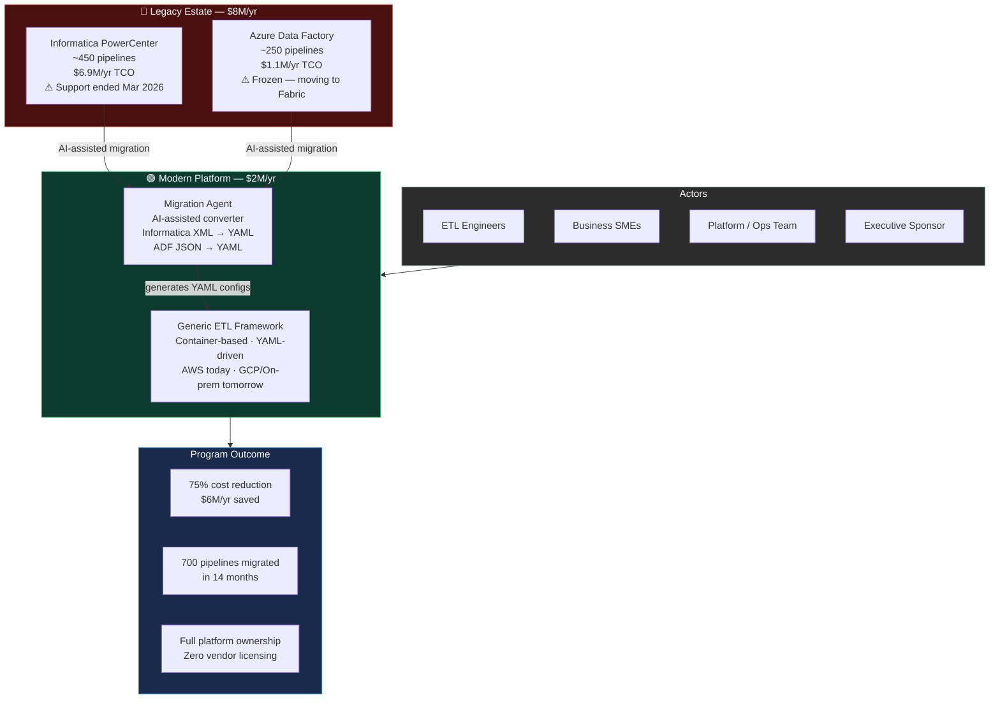
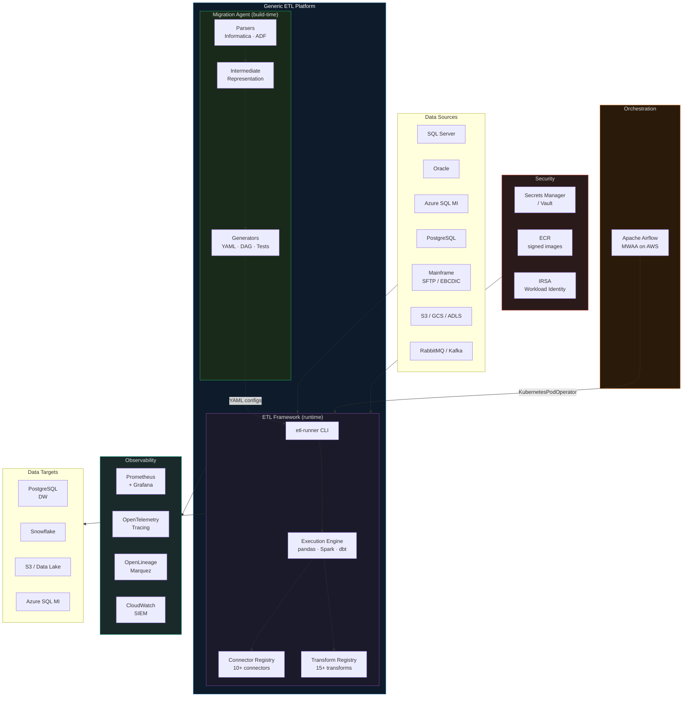
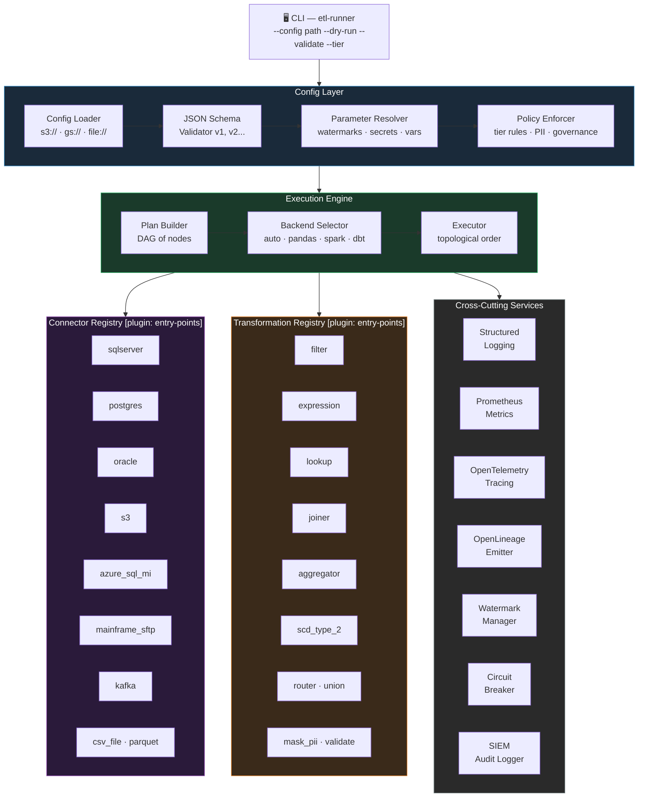
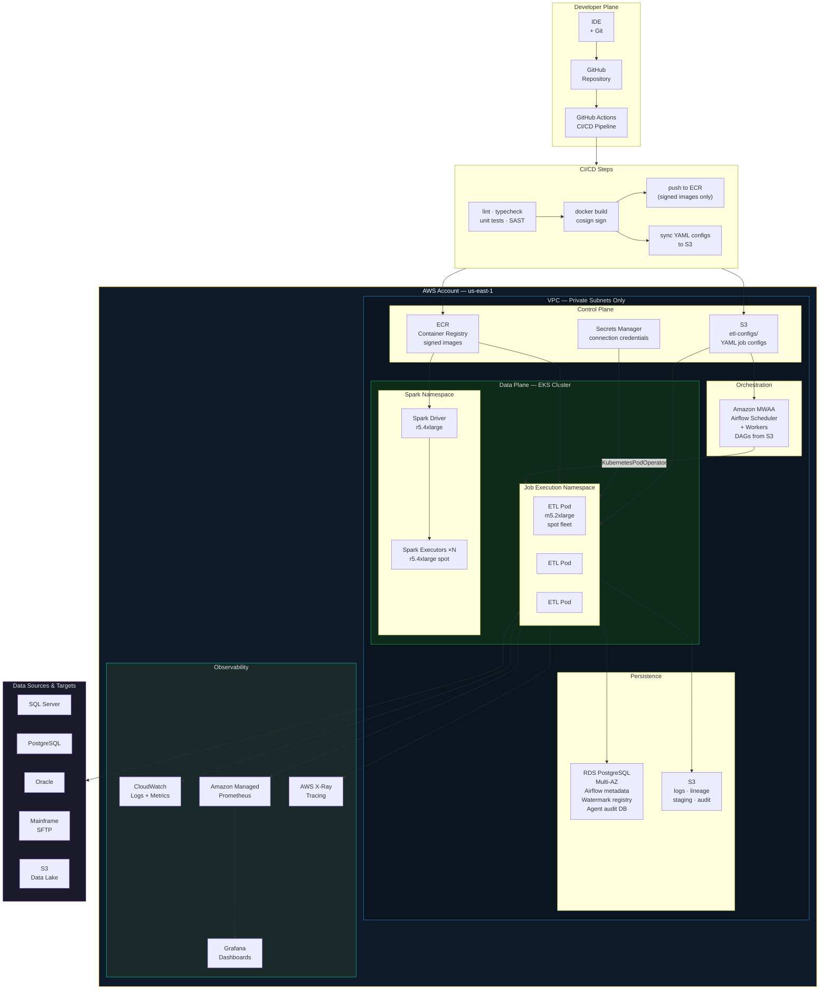
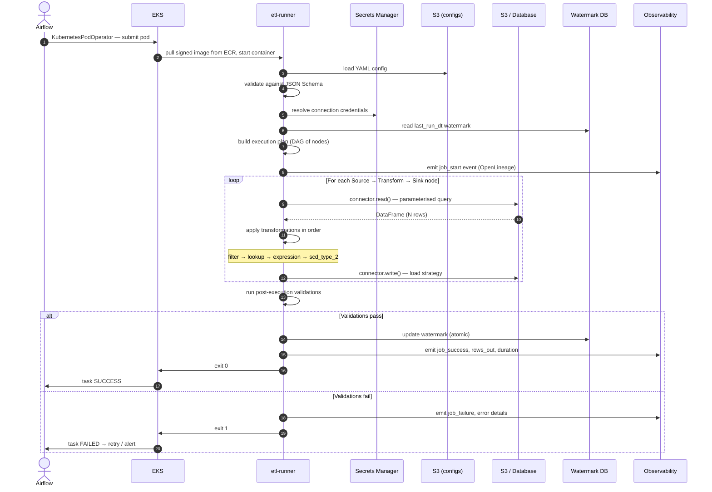
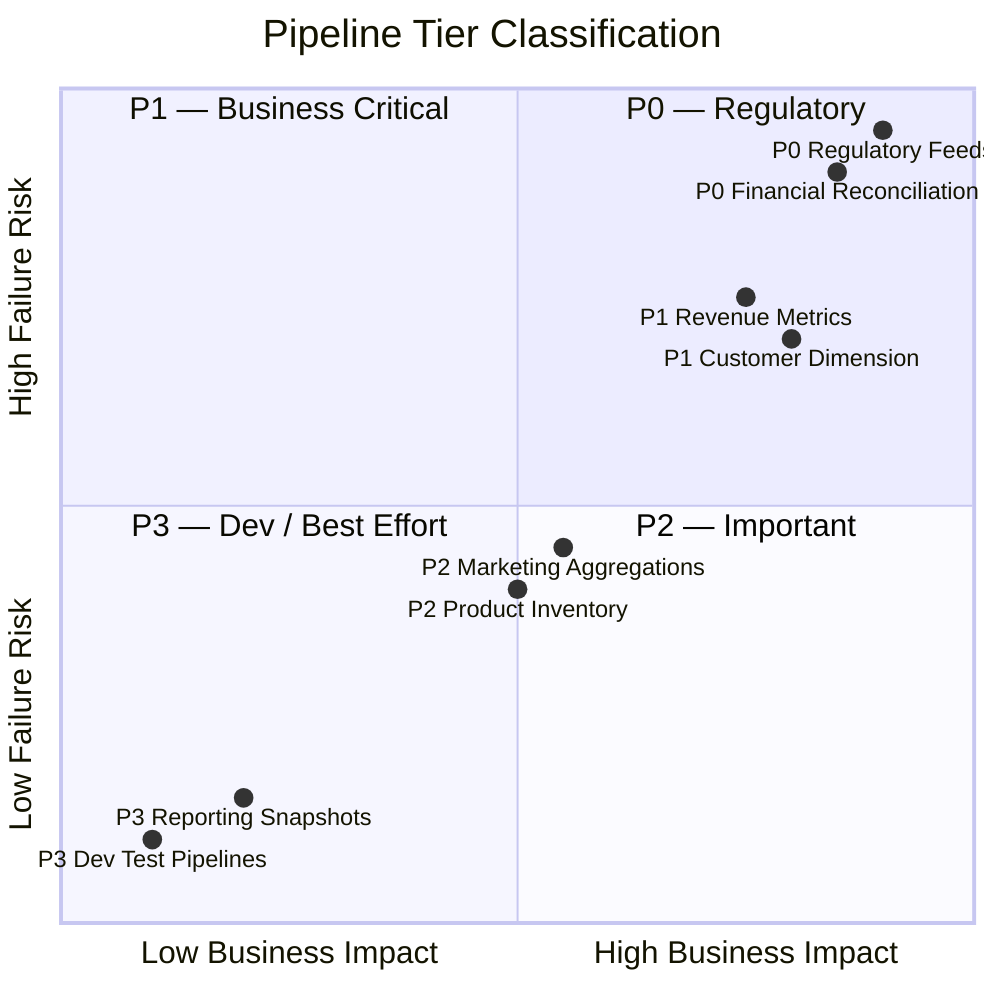
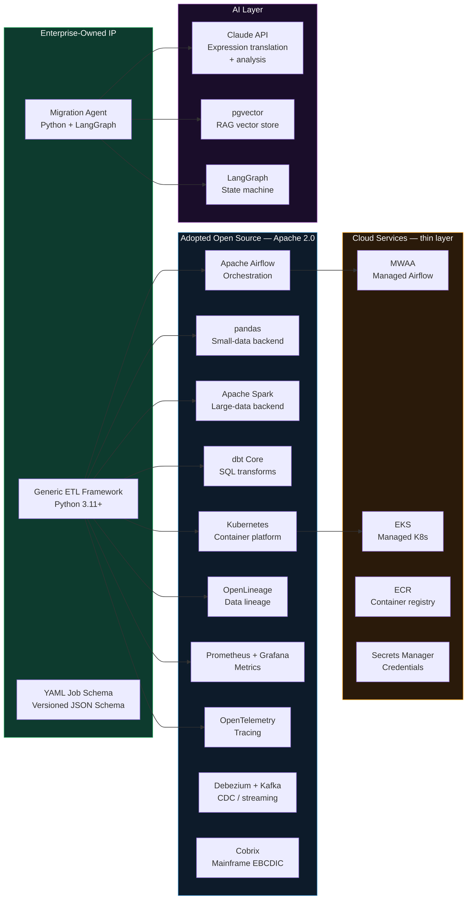

# Enterprise ETL Modernization — Architecture Diagrams

**Document Type:** Architecture Diagrams (L0 → L3)
**Version:** 2.0
**Date:** 2026-05-11
**Classification:** Internal — Architecture Review

---

## L0 — Business Context

What the program replaces, who it serves, and the financial outcome.

---

## L1 — System Context

The full platform in context — all external systems it interacts with.

---

## L2a — Generic ETL Framework (Component Architecture)

---

## L3 — AWS Deployment Architecture

---

## L3b — Multi-Cloud Portability

```mermaid
flowchart LR
    subgraph PORTABLE["100% Portable — Zero Changes"]
        direction TB
        YAML["📄 YAML Job Configs\njobs/*.yaml"]
        IMG["🐳 Container Image\netl-runner:v1.x.x"]
        CODE["🐍 Framework Python Code\nno cloud SDK references"]
    end

    subgraph NEARPORT["~90% Portable — Minor Config Change"]
        DAG["✈️ Airflow DAG Files\nchange: registry URL +\nservice account annotation only"]
    end

    subgraph THIN["Cloud-Specific Thin Layer"]
        direction TB
        subgraph AWS_L["AWS (Today)"]
            direction TB
            A1["MWAA"]
            A2["EKS"]
            A3["ECR"]
            A4["S3"]
            A5["Secrets Manager"]
            A6["CloudWatch"]
        end
        subgraph GCP_L["GCP (Future)"]
            direction TB
            G1["Cloud Composer"]
            G2["GKE"]
            G3["Artifact Registry"]
            G4["GCS"]
            G5["Secret Manager"]
            G6["Cloud Monitoring"]
        end
        subgraph ONP_L["On-Prem K8s (Option)"]
            direction TB
            O1["Self-managed\nAirflow"]
            O2["OpenShift /\nvanilla K8s"]
            O3["Harbor\nRegistry"]
            O4["MinIO / NFS"]
            O5["HashiCorp\nVault"]
            O6["Prometheus\n+ Loki"]
        end
    end

    PORTABLE --> NEARPORT --> THIN

    A1 -.->|"→"| G1
    A2 -.->|"→"| G2
    A3 -.->|"→"| G3
    A4 -.->|"→"| G4
    A5 -.->|"→"| G5
    A6 -.->|"→"| G6

    style PORTABLE fill:#0d3b2e,stroke:#27ae60,color:#fff
    style NEARPORT fill:#2a2a0d,stroke:#f1c40f,color:#fff
    style THIN fill:#1a1a1a,stroke:#7f8c8d,color:#ddd
    style AWS_L fill:#1a2a1a,stroke:#f39c12,color:#ddd
    style GCP_L fill:#1a1a2a,stroke:#4285f4,color:#ddd
    style ONP_L fill:#2a1a1a,stroke:#e74c3c,color:#ddd
```

---

## Data Flow — End-to-End Pipeline Execution

---

## Pipeline Tier SLA Model

---

## Technology Stack

---

*All diagrams are written in Mermaid and render natively in GitHub, GitLab, Notion, and most modern documentation systems.*
*For the migration agent deep-dive (agent taxonomy, heterogeneous coordination, LangGraph design) see [`migration-agent-architecture.md`](./migration-agent-architecture.md).*
*For stakeholder presentations use the companion [`executive-presentation.tsx`](./executive-presentation.tsx).*
