# Migration Agent — Heterogeneous Multi-Agent Architecture

**Document Type:** Agent Design — Deep-Dive  
**Version:** 1.0  
**Date:** 2026-05-11  
**Classification:** Internal — Engineering Review

---

## Why Heterogeneous?

A single monolithic LLM cannot reliably perform every step of ETL migration. Each stage demands a fundamentally different capability profile:

| Stage | What you need | Wrong tool for it |
|---|---|---|
| XML/JSON parsing | Deterministic, schema-aware | LLM (hallucination risk) |
| Complexity scoring | Reproducible heuristic | LLM (inconsistent) |
| Expression translation | High accuracy, auditable | Rule-only (coverage gap) |
| YAML generation | Zero creativity, 100% schema-correct | LLM (format drift) |
| Test generation | AST-aware, fixture-correct | Rules-only (too rigid) |
| Business summary | Fluent natural language | Rules-only (unreadable) |
| Validation | Code execution, row counts | LLM (cannot run code) |

A **heterogeneous agent** system assigns each stage to the right tool — deterministic code, small specialized LLM, or frontier model — and wires them together through a typed state machine. No agent has to be universally capable; each only has to be locally correct.

---

## Agent Taxonomy — Heterogeneous Cyclic Workflow

The workflow is not a linear pipeline. Every tier has feedback paths — failed validation loops back to translation, human rejection loops back to generation, and every approved output feeds the long-term memory that makes the next cycle cheaper and faster.

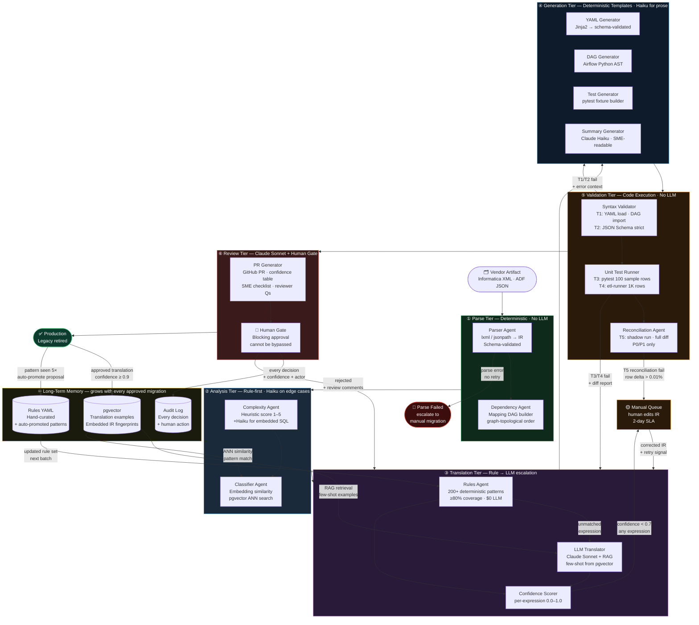

### Reading the Diagram

| Arrow type | Meaning |
|---|---|
| Solid downward | Happy-path forward flow |
| `→ Manual Queue` | Low confidence or reconciliation failure — human corrects IR and retries |
| `→ Translation Tier` (from Validation) | Test failure feeds error context back for re-translation |
| `→ Translation Tier` (from Human Gate) | Reviewer rejection with comments triggers a targeted retranslation |
| `→ pgvector / Rules` | Every approved migration strengthens future runs — the learning cycle |
| `pgvector / Rules →` agents | Memory feeds Classification and Translation on every run |

### Why Cycles Matter

A purely linear pipeline fails at scale. The cycles are what make the system self-correcting:

- **Validation → Translation feedback loop**: when pytest catches a wrong expression, the error diff is injected into the LLM Translator's next prompt as negative context — "previous attempt produced X, which failed because Y." The model corrects without human involvement.
- **Human rejection → Translation feedback loop**: a reviewer's PR comment ("this SCD logic doesn't handle NULL surrogate keys") is parsed and appended to the IR as a structured correction hint before the retranslation pass.
- **Learning cycle**: the more pipelines migrate, the denser the pgvector store becomes. After 200 migrations, the Classifier finds near-exact matches for 70%+ of new mappings — the LLM Translator is barely invoked. After 500 migrations, the Rules Agent receives auto-promoted patterns covering 93%+ of expressions.

The system does not plateau — each wave makes the next wave faster and cheaper.

---

## Supervisor → Worker Control Flow

The Supervisor Agent is the sole router. It never does work itself — it reads the typed `AgentState` after each worker completes and decides what runs next. Workers never call each other directly. Every handoff goes through the Supervisor, which is what makes the system observable, resumable, and auditable.

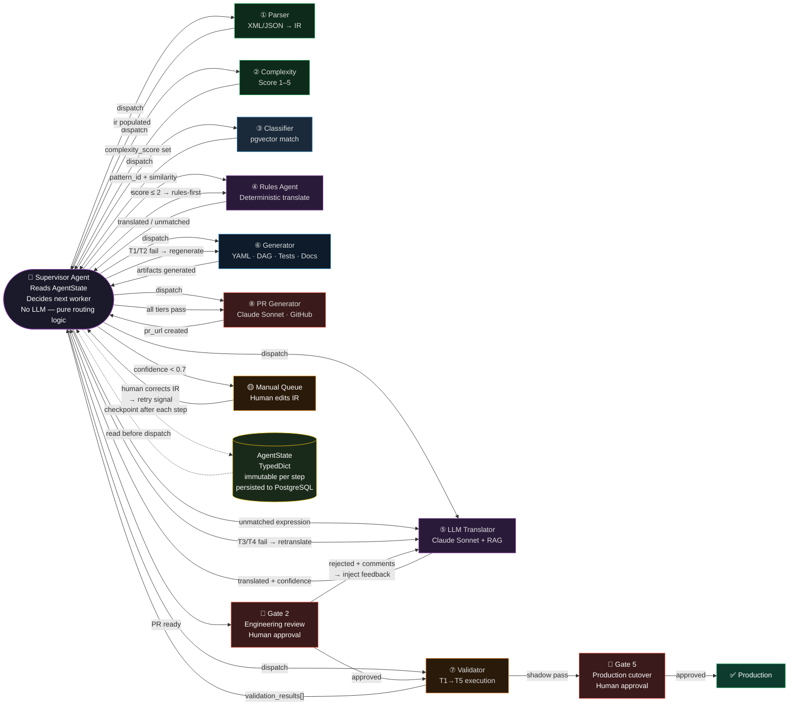

### Control Flow Rules

| Rule | Detail |
|---|---|
| **Supervisor reads state, never skips** | After every worker completes, control unconditionally returns to the Supervisor before any next step |
| **Workers are stateless** | A worker reads from `AgentState`, does its job, writes result back — no worker holds memory between calls |
| **State is persisted at every checkpoint** | `AgentState` is written to PostgreSQL after each step — crash anywhere = resume from last checkpoint |
| **Gates are not workers** | Human gates are `interrupt_before` points in LangGraph — execution halts and resumes only on external signal (PR approval webhook) |
| **Manual Queue re-enters via Supervisor** | A human editing the IR posts a resume signal; the Supervisor re-reads state and routes back to the appropriate worker |
| **No worker-to-worker calls** | W4 cannot call W5 directly — it marks expressions `unmatched=true` in state and returns to Supervisor, which then dispatches W5 |

### Why This Pattern?

The hub-and-spoke control topology (Supervisor as the hub) is a deliberate choice over a peer-to-peer mesh:

- **Observability**: every transition is logged at the Supervisor. You always know which worker has the token.
- **Replaceability**: swap any worker (e.g. replace Claude Sonnet with a fine-tuned model) — Supervisor routing logic is unchanged.
- **Rate limiting**: the Supervisor enforces concurrency limits per worker type — LLM Translator capped at 10 concurrent calls, Validator capped at 5 shadow runs.
- **Human gate enforcement**: only the Supervisor can advance past a gate — no worker can route around it.

---

## Intermediate Representation (IR) — The Common Language

Every agent speaks IR. No agent passes raw Informatica XML or YAML strings to another. This decouples agents completely — you can replace any agent without touching the others.

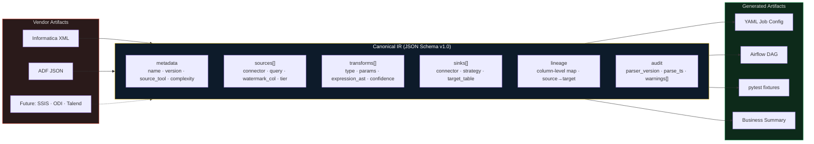

### IR Contract (abridged JSON Schema)

```json
{
  "$schema": "http://json-schema.org/draft-07/schema",
  "title": "ETL Intermediate Representation",
  "version": "1.0",
  "required": ["metadata", "sources", "transforms", "sinks"],
  "properties": {
    "metadata": {
      "required": ["name", "source_tool", "complexity_score"],
      "properties": {
        "name":             { "type": "string" },
        "source_tool":      { "enum": ["informatica", "adf", "ssis", "unknown"] },
        "complexity_score": { "type": "integer", "minimum": 1, "maximum": 5 },
        "auto_convertible": { "type": "boolean" }
      }
    },
    "transforms": {
      "type": "array",
      "items": {
        "required": ["id", "type"],
        "properties": {
          "id":             { "type": "string" },
          "type":           { "enum": ["filter","lookup","expression","scd_type_2","joiner","aggregator","router"] },
          "expression_ast": { "description": "Parsed AST — null if type != expression" },
          "confidence":     { "type": "number", "minimum": 0.0, "maximum": 1.0 },
          "needs_review":   { "type": "boolean" }
        }
      }
    }
  }
}
```

---

## LangGraph State Machine

The Supervisor Agent is a **LangGraph** graph with typed state. Each node is one specialist agent. Edges are routing decisions — no LLM decides routing; only typed state fields do.

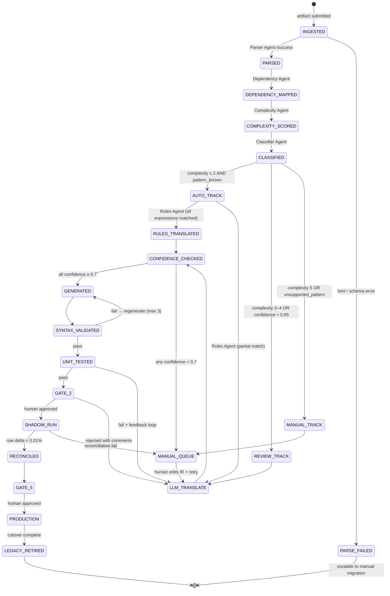

---

## Agent Designs — Detailed

### 1. Parser Agent (Deterministic)

**Role:** Convert raw vendor artifacts → validated IR JSON.  
**No LLM.** Failures are hard errors — no guessing allowed at this stage.

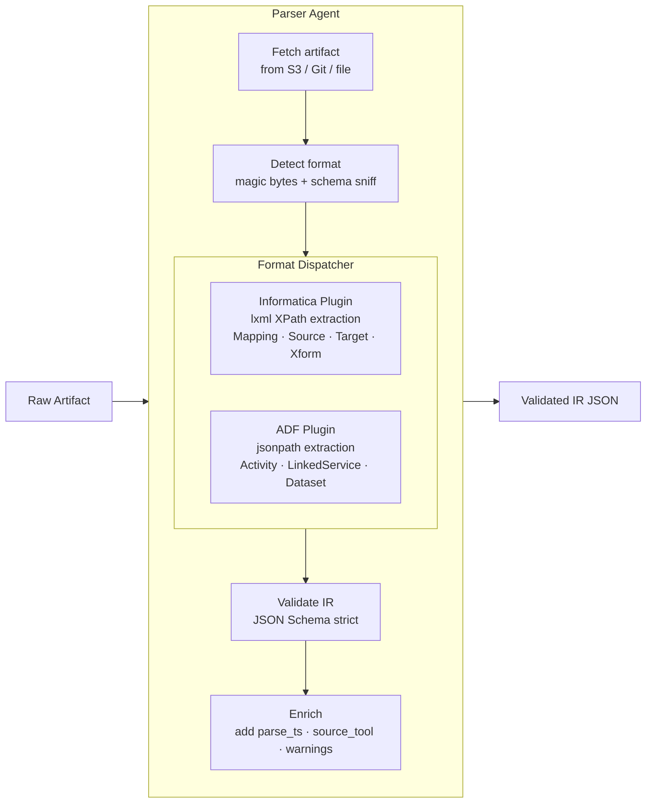

**Tools available:**
- `fs_read(path)` — S3 / local file access
- `xml_parse(content)` — lxml document
- `json_parse(content)` — strict JSON
- `ir_validate(ir_dict)` — JSON Schema validation
- `emit_warning(msg)` — append to `ir.audit.warnings[]`

**Failure modes handled:**
- Malformed XML → `PARSE_FAILED` state, emit structured error
- Unknown mapping type → `ir.metadata.auto_convertible = false`, continue
- Missing source definition → emit warning, mark transform `needs_review = true`

---

### 2. Complexity Agent (Heuristic + Haiku)

**Role:** Score each mapping 1–5 and decide routing track.

**Scoring rubric (deterministic first pass):**

| Signal | Points |
|---|---|
| Number of transformations > 10 | +1 |
| SCD Type 2 present | +1 |
| Joiner with > 3 inputs | +1 |
| Custom expression count > 5 | +1 |
| Mainframe / EBCDIC source | +1 |
| Unsupported transform type | +2 |

Score ≤ 2 → **Auto track**. Score 3–4 → **Review track**. Score ≥ 5 → **Manual track**.

**Haiku is invoked only** when the mapping contains free-form SQL or embedded scripts not covered by the rubric. Haiku's task is solely to classify whether the embedded SQL is "standard ANSI" or "vendor-specific." The routing decision is always made by code, never by the LLM.

```python
class ComplexityAgent:
    def run(self, ir: IRDocument) -> IRDocument:
        score = self._heuristic_score(ir)
        if self._has_embedded_sql(ir):
            sql_class = self._haiku_classify_sql(ir)  # "ansi" | "vendor_specific"
            if sql_class == "vendor_specific":
                score += 1
        ir.metadata.complexity_score = min(score, 5)
        ir.metadata.auto_convertible = score <= 2
        return ir
```

---

### 3. Classifier Agent (Embedding Similarity)

**Role:** Match the IR against known migration patterns in the vector store. High similarity → use existing translation template. Low similarity → flag for LLM + human.

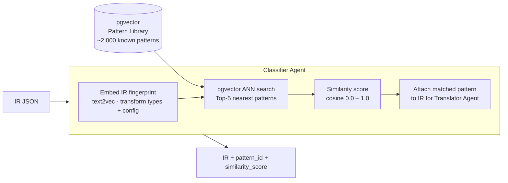

**Pattern library grows over time:** every human-approved migration adds its IR + generated YAML as a new example. The RAG store is the system's long-term memory.

---

### 4. Rules Agent (Deterministic, Zero LLM Cost)

**Role:** Translate Informatica / ADF expressions to Python/pandas using a hand-curated rule table. Target ≥ 80% coverage of common patterns. No LLM invoked — zero cost, fully auditable.

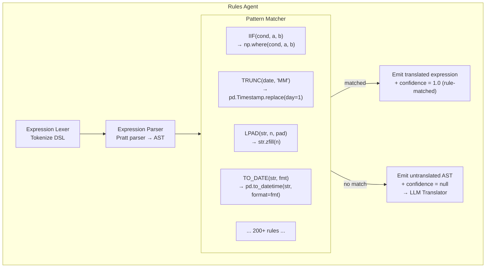

**Rule format (YAML-driven, not hardcoded):**

```yaml
rules:
  - id: iif_to_np_where
    pattern: "IIF({cond}, {a}, {b})"
    output: "np.where({cond}, {a}, {b})"
    confidence: 1.0
    notes: "Informatica conditional — direct map"

  - id: trunc_date_month
    pattern: "TRUNC({col}, 'MM')"
    output: "{col}.dt.to_period('M').dt.to_timestamp()"
    confidence: 1.0
```

New rules are added as human-reviewed translations accumulate — the rule table grows with each migration wave.

---

### 5. LLM Translator Agent (Claude Sonnet + RAG)

**Role:** Handle expressions not covered by rules. Uses Claude Sonnet with few-shot examples retrieved from pgvector. Returns a translated expression + confidence score.

**Only invoked for unmatched expressions** — typical invocation rate after rules coverage: ~15–20% of expressions, ~5% of total tokens.

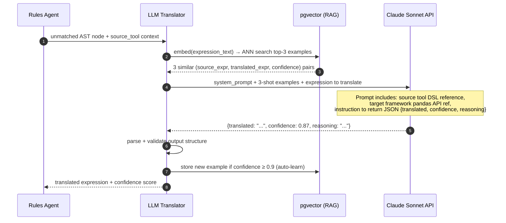

**Prompt structure:**

```
SYSTEM:
You are an ETL expression translator. Convert the given {source_tool} expression 
to a Python/pandas expression that runs inside the Generic ETL Framework.

Rules:
- Return ONLY valid JSON: {"translated": "<expr>", "confidence": 0.0-1.0, "reasoning": "<one sentence>"}
- confidence < 0.7 means you are not sure — do not guess
- Use only pandas, numpy, and Python builtins
- Do not import anything

FEW-SHOT EXAMPLES:
{rag_examples}  ← 3 nearest from pgvector

USER:
Source tool: {source_tool}
Expression: {raw_expression}
Column context: {col_types}
```

---

### 6. YAML Generator Agent (Deterministic, Jinja2)

**Role:** Render the translated IR into a validated YAML job config. No LLM — templates are version-controlled and schema-validated at render time.

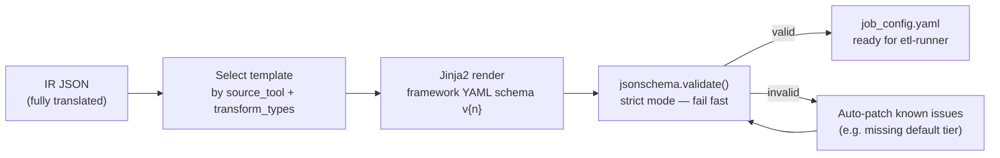

**Key design rule:** If the YAML fails schema validation after 3 auto-patch attempts, the job is sent to `MANUAL_QUEUE` — the Generator never emits invalid YAML to downstream agents.

---

### 7. Validation Agent (Code Execution)

**Role:** Gate keeper before any human review. Five validation tiers executed in order — each failure short-circuits and sends the job back for regeneration.

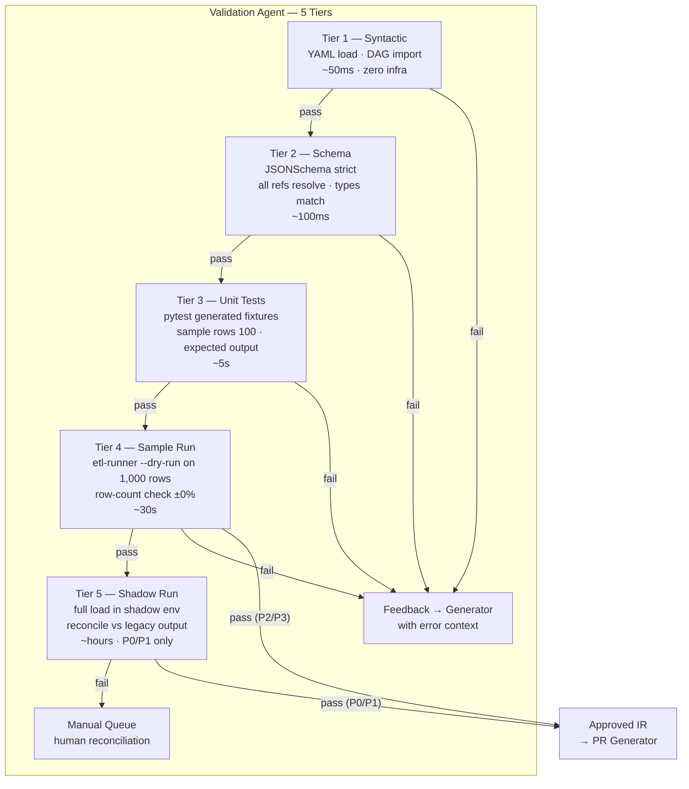

**Tier 5 is only run for P0 and P1 pipelines** — running full shadow execution for 700 pipelines is not practical. P2/P3 proceed after Tier 4.

---

### 8. PR Generator + Reviewer Agent (Claude Sonnet)

**Role:** Draft a GitHub PR that a human engineer and business SME can actually review — not a raw YAML dump. Surfaces confidence scores, flags expressions that need SME sign-off, and generates plain-language business description.

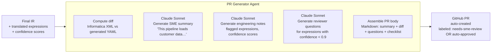

**PR body sections (auto-generated):**
1. **What changed** — plain English description of the mapping
2. **Confidence summary** — table of all expressions with scores
3. **Expressions needing review** — only those below 0.9
4. **SME checklist** — business logic questions requiring domain sign-off
5. **Test results** — Tier 1–4 pass/fail summary
6. **Rollback plan** — how to revert if production issues occur

---

## Agent Coordination — Message Bus

Agents do not call each other directly. All state passes through the LangGraph `AgentState` typed dict. The Supervisor reads state after each node and routes to the next node — or halts at a human gate.

```mermaid
flowchart TB
    subgraph STATE["AgentState  (TypedDict — immutable per step)"]
        direction LR
        S1["artifact_path: str"]
        S2["ir: IRDocument | None"]
        S3["track: 'auto' | 'review' | 'manual'"]
        S4["confidence_scores: dict[str, float]"]
        S5["validation_results: list[ValidationResult]"]
        S6["generated_artifacts: GeneratedArtifacts"]
        S7["gate_status: dict[GateId, 'pending'|'approved'|'rejected']"]
        S8["error_log: list[AgentError]"]
        S9["retry_count: dict[NodeId, int]"]
    end

    subgraph GRAPH["LangGraph Graph"]
        direction TB
        N1["parser_node"] --> N2["dependency_node"] --> N3["complexity_node"]
        N3 --> N4{"route_by_track"}
        N4 -- "auto" --> N5["rules_node"]
        N4 -- "review/manual" --> N6["llm_translate_node"]
        N5 --> N7{"unmatched?"}
        N7 -- "yes" --> N6
        N7 -- "no" --> N8["generator_node"]
        N6 --> N8
        N8 --> N9["validator_node"]
        N9 --> N10{"gate_2_node\nHUMAN INTERRUPT"}
        N10 --> N11["shadow_run_node"]
        N11 --> N12{"gate_5_node\nHUMAN INTERRUPT"}
        N12 --> N13["production_node"]
    end

    STATE -.->|"read/write"| GRAPH

    style STATE fill:#1a2a3a,stroke:#2e86c1,color:#fff
    style GRAPH fill:#0d1b2a,stroke:#8e44ad,color:#fff
```

**Human gates as LangGraph interrupts:**

```python
# Gate 2 — Engineering Review
graph.add_node("gate_2", gate_node(gate_id="GATE_2"))
graph.add_edge("validator", "gate_2")

# LangGraph interrupt — execution pauses here until human approves via API
graph.compile(interrupt_before=["gate_2", "gate_5"])
```

When a gate fires:
- State is persisted to PostgreSQL
- GitHub PR is opened (if not already)
- Slack notification sent to reviewer queue
- Execution resumes only when `/approve` or `/reject` is posted in the PR

---

## Parallelization Strategy

Many pipelines are independent. The Supervisor launches multiple LangGraph runs in parallel — up to 50 concurrent — across the pipeline batch. Within a single mapping run, some agents can also parallelize.

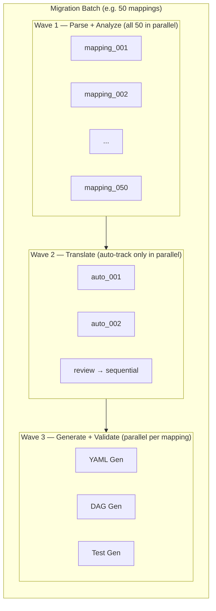

**Within a single mapping, generation is parallel:**

```python
async def generate_all(ir: IRDocument) -> GeneratedArtifacts:
    yaml_task  = asyncio.create_task(yaml_generator.run(ir))
    dag_task   = asyncio.create_task(dag_generator.run(ir))
    test_task  = asyncio.create_task(test_generator.run(ir))
    summary_task = asyncio.create_task(summary_generator.run(ir))
    return GeneratedArtifacts(
        yaml    = await yaml_task,
        dag     = await dag_task,
        tests   = await test_task,
        summary = await summary_task,
    )
```

---

## LLM Cost Management

The system is designed to minimize LLM calls. The vast majority of work is deterministic.

```mermaid
quadrantChart
    title Agent LLM Usage vs Volume
    x-axis Low Invocation Volume --> High Invocation Volume
    y-axis Cheap Model (Haiku) --> Expensive Model (Sonnet/Opus)
    quadrant-1 Avoid — redesign as rules
    quadrant-2 Acceptable — review carefully
    quadrant-3 Ideal — scale freely
    quadrant-4 Acceptable — optimize with caching

    SQL Classifier (Haiku): [0.3, 0.15]
    Summary Generator (Haiku): [0.7, 0.1]
    PR Generator (Sonnet): [0.4, 0.7]
    LLM Translator (Sonnet + cache): [0.5, 0.65]
    Complexity (rules-first): [0.2, 0.1]
    YAML Generator (no LLM): [0.05, 0.05]
    Validator (no LLM): [0.05, 0.05]
```

**Cost model per pipeline (estimated):**

| Component | Model | Avg tokens | Cost/pipeline |
|---|---|---|---|
| SQL classifier | Haiku | ~500 | $0.0001 |
| Expression translation (20% hit rate) | Sonnet | ~2,000 | $0.006 |
| PR + SME summary | Sonnet | ~3,000 | $0.009 |
| Prompt cache savings (~60% hit rate) | — | — | −$0.005 |
| **Total per pipeline** | | | **~$0.01** |

700 pipelines × $0.01 = **~$7 total LLM cost** for the full migration. Dominated by human time, not LLM spend.

---

## Memory Architecture

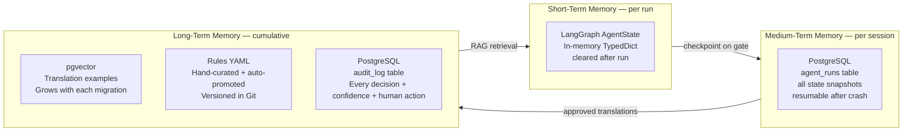

**Auto-learning loop:** When a human approves a translation that came from the LLM Translator with confidence ≥ 0.9, the system automatically:
1. Adds it to the pgvector store (improves future RAG retrieval)
2. If the same pattern appears 5+ times, proposes a new rule to the Rules YAML (human-reviewed PR)

Over 18 months and 700 pipelines, the rule coverage is expected to grow from 80% → 95%+, and LLM invocation rate to drop proportionally.

---

## Failure Handling and Retry Topology

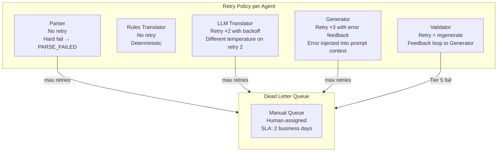

---

## Implementation — File Layout

```
agent/
├── cli.py                        # Entry point — batch or single mapping
├── state.py                      # AgentState TypedDict + IRDocument dataclasses
├── graph.py                      # LangGraph graph definition + compile()
├── agents/
│   ├── parser/
│   │   ├── informatica.py        # lxml XPath extraction
│   │   ├── adf.py                # jsonpath extraction
│   │   └── base.py               # BaseParser ABC
│   ├── analysis/
│   │   ├── complexity.py         # Heuristic scoring + Haiku SQL classifier
│   │   └── classifier.py         # pgvector ANN search
│   ├── translation/
│   │   ├── rules_agent.py        # Lexer + Pratt parser + rule matching
│   │   ├── rules/
│   │   │   └── informatica.yaml  # 200+ rule definitions
│   │   ├── llm_translator.py     # Claude Sonnet + RAG prompt
│   │   └── confidence.py         # Per-expression scoring + routing
│   ├── generation/
│   │   ├── yaml_generator.py     # Jinja2 templates → validated YAML
│   │   ├── dag_generator.py      # Airflow Python AST builder
│   │   ├── test_generator.py     # pytest fixture builder
│   │   └── summary_generator.py  # Claude Haiku plain-language summary
│   ├── validation/
│   │   ├── syntax_validator.py   # Tier 1–2
│   │   ├── unit_test_runner.py   # Tier 3 — subprocess pytest
│   │   └── reconciliation.py     # Tier 4–5 — row count + sample diff
│   └── review/
│       └── pr_generator.py       # GitHub PR + Claude Sonnet PR body
├── memory/
│   ├── vector_store.py           # pgvector client + embed + ANN search
│   └── audit_log.py              # PostgreSQL write + read
└── gates/
    └── human_gate.py             # LangGraph interrupt + Slack notify + resume
```

---

## Key Design Principles

1. **LLM is the last resort, not the first** — rules, heuristics, and templates handle 80%+ of the work deterministically. LLMs fill the gap.
2. **IR is the contract** — agents are loosely coupled through typed JSON. Any agent can be replaced without touching others.
3. **Humans gate the irreversible** — no agent can promote a pipeline to production. The five gate checkpoints are code-enforced LangGraph interrupts.
4. **Confidence is first-class** — every translated expression carries a score. Low confidence surfaces immediately to human reviewers rather than being buried in a YAML file.
5. **The system learns** — every human-approved translation improves future recall via pgvector. The more pipelines migrated, the cheaper and faster subsequent migrations become.

---

*For the platform-level architecture see [`enterprise-architecture-diagram.md`](./enterprise-architecture-diagram.md). For the executive overview see [`executive-presentation.tsx`](./executive-presentation.tsx).*
